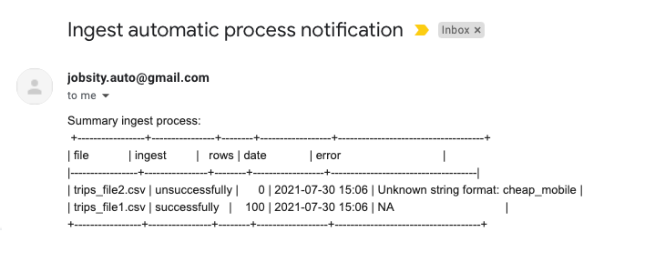
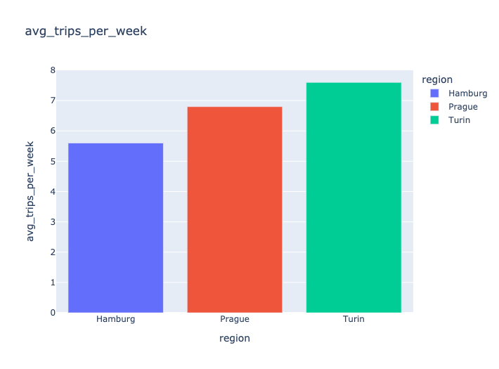
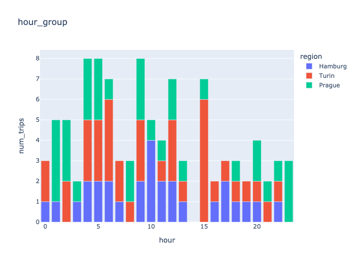

# Jobsity
Jobsity Data Engineering Challenge


This **README.md** should give you the tools to set up the python environment and run this code for test purposes.

This process was designed to extract, transform and load all the files from a specific folder to an instance of MySql inside of the **trips** TABLE.

The **trips** TABLE has the following structure.


| id | region | origin_lon | origin_lat | destination_lon | destination_lat | datetime            | datasource | created_at          |


---


After the ETL process the file is moved to a backup folder to keep track of all the files uploaded to the database. These files are renamed with the date of ingest. And send the status of the ingest process by email with the number of rows added in case of a successful ingest or an error message in case of an unsuccessful ingest.

_The email should look like this._



Inside the Mysql instance exist two storage procedures: one for the automatic fill of **hour_group** TABLE that contains the group by similar origin, destination, and time of day. And another for the automatic fill of **weekly_avg_trips** that contain the weekly average number of trips for an area.


 
## Setup Steps 📦

### MySql

Create an mysql instance.

---
#### Query for the database creation


```sql
CREATE DATABSE jobsity;
```
---
#### Query for the table creation

**trips** TABLE


```sql
CREATE TABLE trips (
id int NOT NULL AUTO_INCREMENT PRIMARY KEY,
region VARCHAR(30) NOT NULL,
origin_lon FLOAT,
origin_lat FLOAT,
destination_lon FLOAT,
destination_lat FLOAT,
datetime TIMESTAMP,
datasource VARCHAR(30) NOT NULL,
created_at DATETIME NOT NULL DEFAULT CURRENT_TIMESTAMP
);
```

**hour_group** TABLE

```sql
CREATE TABLE hour_group (
hour int NOT NULL,
region VARCHAR(30) NOT NULL,
num_trips int NOT NULL
);
````

**weekly_avg_trips** TABLE

```sql
CREATE TABLE weekly_avg_trips (
region VARCHAR(30) NOT NULL,
avg_trips_per_week FLOAT
);
````

---

#### Query for MySQL Stored Procedures 

**Procedure to group similar origin, destination, and time of day**
```sql
delimiter $$
```

Use this query to set the store procedure
```sql
CREATE PROCEDURE FILL_hour_group()
BEGIN
TRUNCATE TABLE hour_group;
INSERT INTO hour_group
SELECT
hour,
region,
count(*) as num_trips
FROM
(
SELECT
HOUR(datetime) as hour,
region
FROM TRIPS
) AS hour_table
GROUP BY hour, region
Order BY hour, region;
END$$
````

Change again the delimiter
```sql
delimiter ;
```
```sql
CREATE EVENT update_hour_group
    ON SCHEDULE EVERY 1 HOUR
    DO
      CALL FILL_hour_group();
```


**Procedure to obtain the weekly average number of trips for an area**
```sql
delimiter $$
```

Use this query to set the store procedure
```sql
CREATE PROCEDURE FILL_weekly_avg_trips()
BEGIN
TRUNCATE TABLE weekly_avg_trips;
INSERT INTO weekly_avg_trips
SELECT
region,
avg(trips) as avg_trips_per_week
FROM
(
SELECT
CONCAT(YEAR(datetime),'-', week(datetime)) as 'week',
region,
count(*) as 'trips'
FROM trips
GROUP BY week, region
) as week_count
GROUP BY  region;
END$$
````

Change again the delimiter
```sql
delimiter ;
```
```sql
CREATE EVENT update_weekly_avg_trips
    ON SCHEDULE EVERY 1 HOUR
    DO
      CALL FILL_weekly_avg_trips();
```
---

### Python environment

Set up a virtual for all the python libraries. Please follow the following commands.
```python
python3 -m venv ./venv
```
```python
source venv/bin/activate
```
```python
pip install --upgrade pip
```
```python
pip install -r requirements.txt 
```

### Make .env file

This file is used to store all the sensitive variables and the variables that change due to specific needs like the database credentials, email sender password or email receiver address. This file should be located inside of the **ingest_data** FOLDER with the following commands.

```terminal
touch .env
```

The variables inside of this file should see like this.

```terminal
DB_USER = 'root'
DB_PASSWORD = '123456789'
DB_NAME = 'jobsity'
DB_HOST = 'local'
DB_PORT = '3306'
FOLDER_PATH = '/Users/your_user/Documents/jobsity_challenge/new_data'
FOLDER_BACKUP_PATH = '/Users/your_user/Documents/jobsity_challenge/backup'
SENDER_EMAIL = 'jobsity.auto@gmail.com'
EMAIL_PASSWORD = 'password2021'
REC_EMAIL = 'example@gmail.com'
```

The variables **DB_USER ; DB_PASSWORD : DB_NAME : DB_HOST** and **DB_PORT** are used for the Mysql connection. These variables are particular depending on the database

The variables **FOLDER_PATH** and **FOLDER_BACKUP_PATH** are used to define the path for new files to be ingested and the path after the file is ingest.

The variables **SENDER_EMAIL** and **EMAIL_PASSWORD** are used to send the email with the notification of the ingest process. You can use these for it.

The variable **REC_EMAIL** is the email address that will receive the email with the status of the ingest process.

---
## Results and images

Weekly average number of trips for an area.



Group by similar origin, destination, and time of day.



---


## How to use

After the python environment is on and the file **.env** was created and completed with the necessary data. The process can be triggered with the following command.

```terminal
python ingest_data/ingest_data.py
```

This process can also be started with a crontab process
